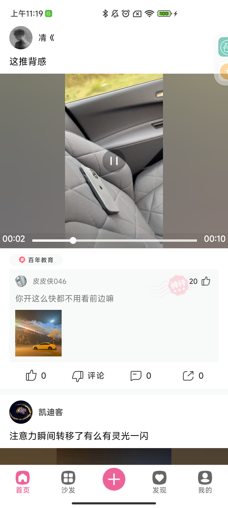
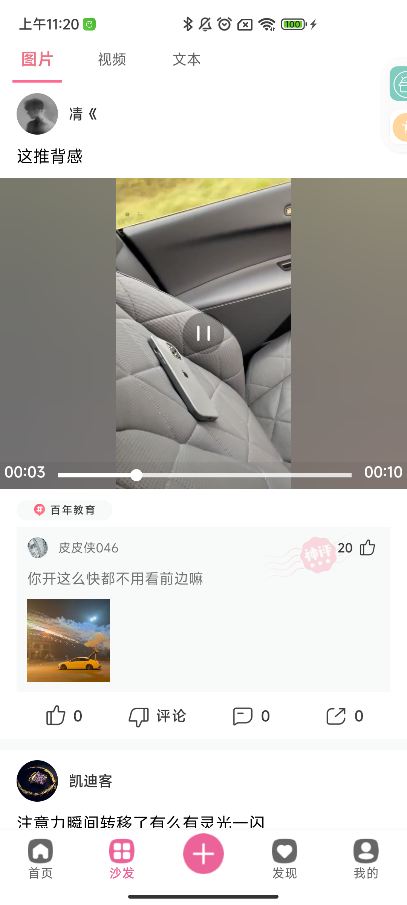
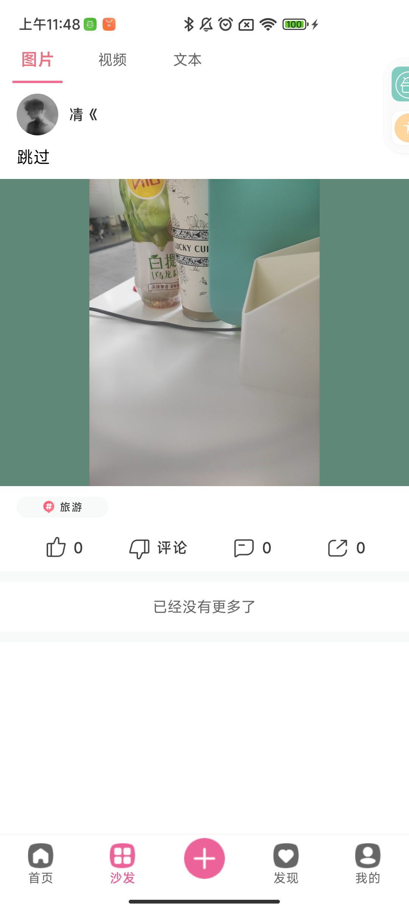
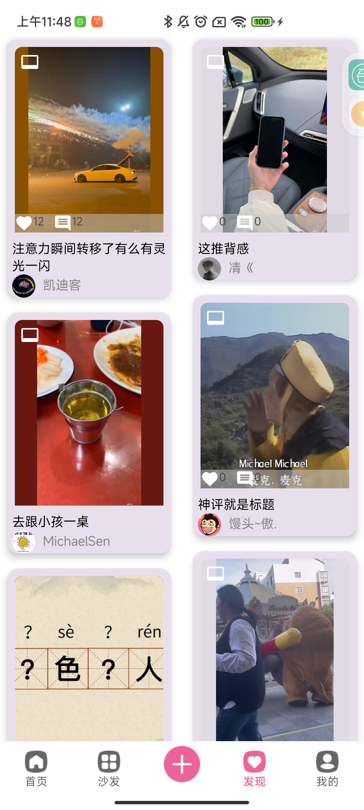

### Jetpack+Compose打造一款短视频APP

> 一款使用 **Jetpack Compose** 构建的现代化短视频社交应用，支持视频浏览、发布、点赞、评论与用户系统。  
> 采用 **MVVM 架构 + Hilt 依赖注入 + ExoPlayer 播放器封装**，展示 Kotlin 在移动端的最佳实践，主要功能模块已基本完成

---
 
---

## 🚀 功能与特性

### 🏗 架构设计
- **MVVM 架构模式**：数据层与UI层彻底解耦，逻辑清晰。
- **Jetpack 组件库**：ViewModel、LiveData、Room、Navigation、DataStore。
- **Compose 声明式UI**：支持动态主题、动画与响应式布局。

### 🌐 网络与数据
- **Retrofit + OkHttp + Coroutine**：高效异步网络请求。
- **Kotlinx Serialization**：统一数据序列化/反序列化。
- **Paging 3 分页加载**：视频Feed流的懒加载与缓存。
- **DataStore + Room 持久化**：用户信息、本地缓存与浏览历史。

### 🎥 视频播放模块
- **基于 ExoPlayer 的 视频播放器封装组件**。
- **自动播放与预加载机制**，滑动即播。
- **Lifecycle 感知**：自动暂停/恢复播放，后台安全。

### 👤 用户与社交
- QQ 登录接入。
- 用户主页：头像、关注/粉丝、发布视频展示。
- 增加点赞 / 评论 / 关注系统。
- 视频发布模块：本地视频选择、封面生成、上传接口。

## 🖼 应用预览截图

  
  
  
  
  
  
  
  

## 🧩 TODO / 未来计划
- [ ] 微信登录接入
- [ ] 视频上传接口完善
- [ ] 增加支持本地视频拍摄与剪辑功能
- [ ] 增加评论系统表情包支持
- [ ] 增加多语言与国际化（中/英）
- [ ] 性能优化与内存监控  